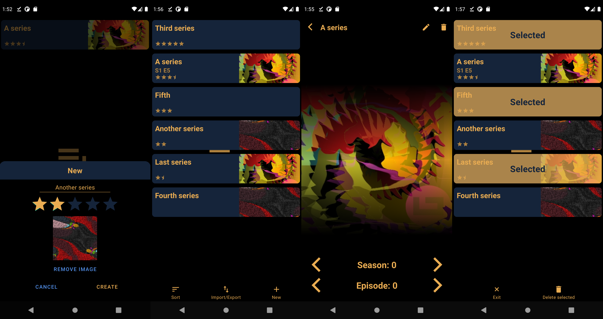

# EpisodeCounter
> EpisodeCounter keeps track of your series.

Have you ever found yourself in a situation where your don't remember the name of all the good series you have watched? Maybe you want to suggest a series to a friend but can't remeber its name or maybe you can't remeber what episode you last watched. EpisodeCounter helps you keep track of your series for you and is easy to use.

## Prerequisites

A device with at least Android 5.0 (Lollipop) if installing the APK or AndroidStudio if editing the project.

## Installation

Download the APK (apk/episode_counter.apk) and install on your Android device or clone or fork the project and edit it in AndroidStudio.

## TODO

- Make the RecycerView scroll to the top when a new sorting option is seleted

